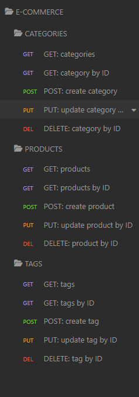
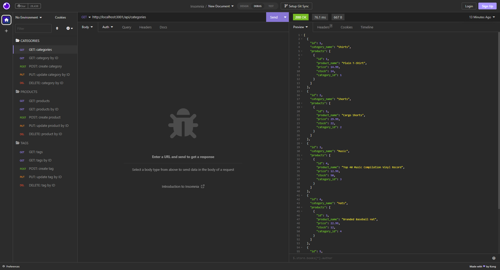
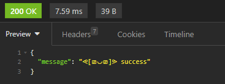
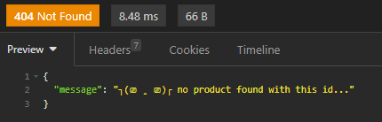

# E-Commerce Backend

## Description

The purpose of creating this repository is to integrate cutting-edge technologies into the backend of an e-commerce website, enabling it to rival other e-commerce companies.

 

## Table of Contents
  - [Demonstration](#demonstration)
  - [Installation](#installation)
  - [Usage](#usage)
  - [Credits](#credits)

 

## Demonstration
Application Demonstration:\
Watch it on [Google Drive](https://drive.google.com/file/d/1G16PNOc2ByignvzhfrgInHtc4C0RSdWQ/view)
<video alt='walkthrough video of the routes using the RESTful apis via Insomnia' src="./Assets/E-Commerce%20Backend.mp4" controls title="Title"></video>

Application Preview:\
Screenshot of Insomnia Folders:\

Screenshot of one of the GET route:\

Screenshot of status 200 when PUT/DELETE routes are successful:\

Screenshot of status 404 when ID is not found:\

 

## Installation

Make sure to have Node.js installed on your system.

To install:\
Please refer to the [Node.js](https://nodejs.org/en/download) site.

 

Make sure to have Insomnia installed on your system.

To install:\
Please refer to the [Insomnia](https://insomnia.rest/download) site.

 

Verify that all the necessary dependencies, packages, or modules are properly installed.

To install:
1. Right click on the Main folder and select "Open in Integrated Terminal" in VS Code.
2. Type "npm install" in the terminal.

 

## Usage

To access the application:

1. Clone the repository from GitHub.
2. Enter username and password in the ".env.Example" file, and rename the file to ".env"
3. Right click on the Main folder in the explorer section and select "Open in Integrated Terminal". 
4. Create database with MySql (i.e. source db/schema.sql;), after login in (i.e., -uroot -p).
5. Seed the database by typing "node seeds/index.js".
6. Type "node server" or "npm start" in the terminal.
7. Open up Insomnia and enter routes:
    1. GET/POST categories via http://localhost:3001/api/categories
    2. GET/PUT/DELETE category by ID via http://localhost:3001/api/categories/(your-id-here)
    3. GET/POST products via http://localhost:3001/api/products
    4. GET/PUT/DELETE product by ID via http://localhost:3001/api/products/(your-id-here)
    5. GET/POST tags via http://localhost:3001/api/tags
    6. GET/PUT/DELETE tag by ID via http://localhost:3001/api/tags/(your-id-here)

 

## Credits

The application integrates external npm packages including sequelize, dotenv, mysql2, and express.